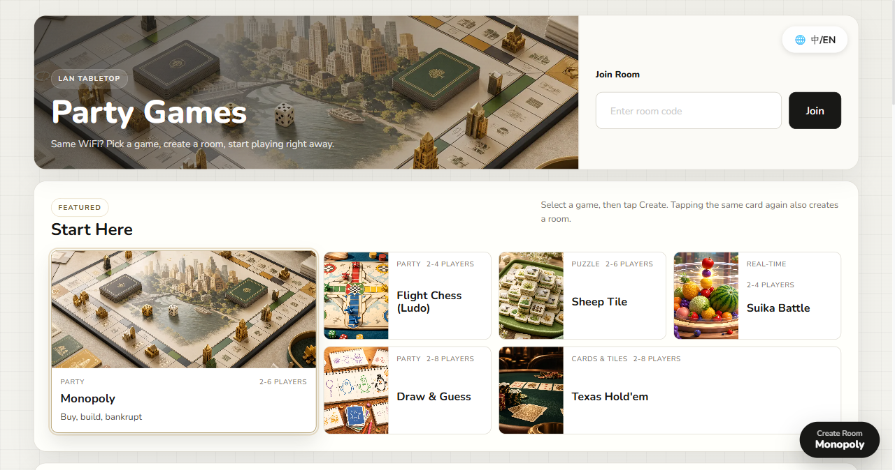
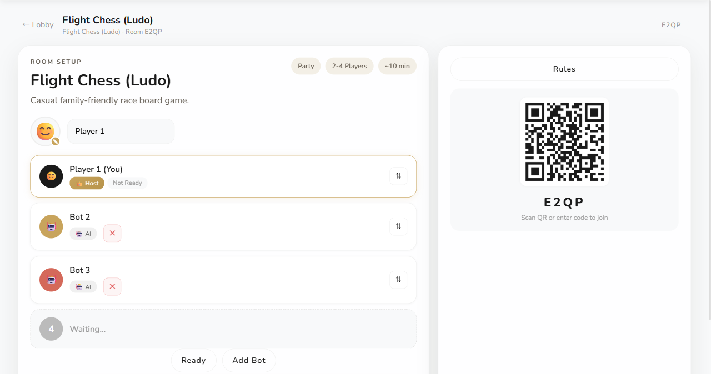
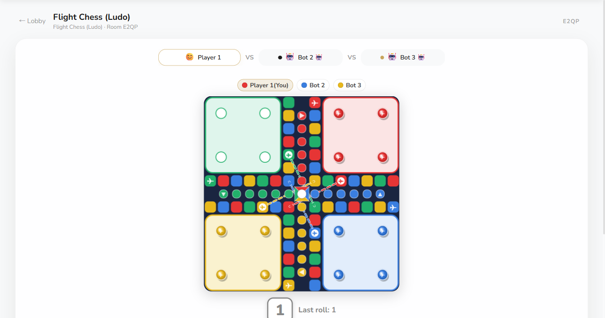
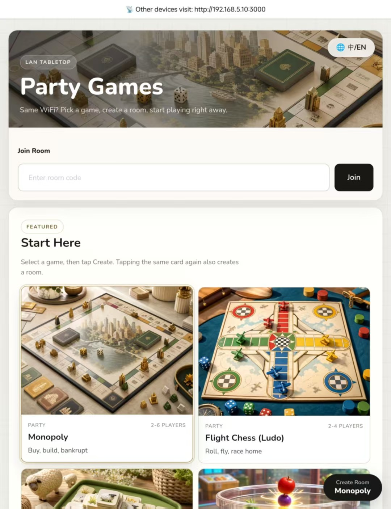

# GameNest

> 34 LAN games you can play with friends without internet: board, card, mahjong, party, puzzle, and real-time. One phone or PC hosts (a hotspot is enough), everyone else scans a QR code and plays in the browser. No data plan, no app install.

**[🚀 Live Demo](https://gamenest-4kww.onrender.com) — try it without installing.**

[](LICENSE)
[](https://github.com/absswds/GameNest/actions/workflows/ci.yml)
[](https://github.com/absswds/GameNest/actions/workflows/android-apk.yml)
[](https://nodejs.org/)
[](https://expressjs.com/)
[](#game-catalog)
[](#highlights)
[](#highlights)
[](#android-host)

[简体中文](README.zh-CN.md) | English

GameNest is a lightweight open-source tabletop game room for family nights, dorm rooms, classrooms, offices, and small parties. One laptop or Android phone hosts the room, everyone else joins from a browser on the same local network, and the stack stays intentionally simple: Express 4, `ws`, and plain HTML/CSS/JavaScript.

## Why GameNest

It started on a long flight with friends: hours with no internet and nothing to do, and every game on our phones either needed a connection or was single-player. So we built GameNest. One phone runs a hotspot and hosts the room, everyone else joins from a browser, and nobody needs mobile data or an app install.

Since then it has become our go-to for dorm nights, parties, family evenings, and classrooms.

## Highlights

- **Works offline**: planes, trains, campsites, basements. One phone hotspot or one shared WiFi is enough; no internet is needed at any point.
- **Only the host installs anything**: an Android phone, a Windows PC (standalone exe), or any machine with Node.js can host. Everyone else scans a QR code or types a room code and plays in the browser.
- **34 games**: board games, poker, mahjong, party games, deduction, social deduction, puzzle races, and real-time battles, for 2 players up to a whole group.
- **Bots fill empty seats**: most turn-based games have AI players, so you can also practise alone.
- **Reconnect and resume**: drop out or leave by accident and the lobby's resume card puts you back in your seat.
- **Hidden info stays hidden**: hands and roles are only sent to their owner, so nobody can peek at the network traffic.
- **Chinese and English** UI and rules tutorials.
- **No accounts, no ads, no tracking**: Apache-2.0, with a simple stack (Express 4 + `ws` + plain JS, no build step) that makes adding a game easy.
- **AI agents can play too**: the optional MCP server (`mcp/`) lets Claude, Cursor, Codex and other agents join a room as a normal seat. See [mcp/README.md](mcp/README.md).

> If GameNest saved your game night, please ⭐ it so others can find it.

## Screenshots

GameNest runs as a shared LAN lobby, a QR-code waiting room, and browser-based game boards:







Mobile and join-flow previews:




## Quick Start

> Requires Node.js 18 or later.

```bash
npm install
npm start
```

Open the lobby on the host machine:

```text
http://localhost:3000
```

Other phones, tablets, or laptops on the same WiFi can join with:

```text
http://<host-ip>:3000
```

If port `3000` is busy, the server automatically tries the next free port and prints the address it ended up on. Set `PORT=xxxx` to choose one yourself.

## How It Works

1. Start GameNest on one computer or Android device.
2. Open the lobby and choose a game.
3. Create a room, then share the room code, host IP, or QR code.
4. In the waiting room, adjust seats, add bots, change avatars, and mark players ready.
5. Start the match and keep playing in the browser while state syncs over WebSocket.
6. If someone briefly leaves, they can return to the room from the lobby resume card.

## Game Catalog

| Category | Games |
| --- | --- |
| Board Games | Tic-Tac-Toe, Gomoku, Chinese Chess, Chess, Checkers, Connect Four, Reversi, Go 9x9, Battleship |
| Cards & Tiles | Texas Hold'em, Dou Dizhu, Davinci Code, Rummikub, Liar's Bar, Big Two, Mahjong (Sichuan & Cantonese), Hearts, Three Kingdoms Showdown |
| Party | Monopoly, Flight Chess, Draw & Guess, UNO, Number Bomb, Old Maid, Exploding Kittens, Truth or Dare, Werewolf |
| Puzzle | Sheep Tile, 24 Game, Sudoku, 2048, Minesweeper Race |
| Real-time | Suika Battle, Snake Battle |

## Commands

```bash
npm start             # start the LAN server
npm test              # run regression tests
npm run check         # syntax-check project JavaScript
npm run test:monopoly # run focused Monopoly tests
npm run build:desktop # build Windows standalone exe
```

CI currently runs `npm run check` and `npm test` (including the MCP server tests) on GitHub Actions.

## Platform Notes

### Browser host

- Requires Node.js `18+`
- HTTP and WebSocket share port `3000`
- Best fit for laptops, desktops, classrooms, and home LAN play

### Android host

The Android project wraps the same Node.js server with nodejs-mobile and a WebView.

```powershell
cd android
.\copy-nodejs-project.ps1
```

Then open `android/` in Android Studio and run the app. Full setup details live in [android/SETUP.md](android/SETUP.md).

## Repository Layout

```text
.
|-- server.js                 # Express + WebSocket server, rooms, routing, bots
|-- desktop-entry.js          # desktop launcher (pkg entry; sits beside server.js)
|-- startup-port.js           # port-retry helper required by server.js
|-- games/                    # game rules and state transitions
|-- bots/                     # AI move generators
|-- lang/                     # server-side text
|-- public/                   # browser lobby, game shell, renderers, styles, assets
|-- scripts/                  # smoke simulations and maintenance helpers
|-- tests/                    # node:test regression suites
|-- android/                  # Android Studio wrapper project (incl. nodejs-mobile main.js)
|-- mcp/                      # optional MCP server: let an AI agent join a room as a player
|-- docs/                     # architecture and release notes
`-- archive/                  # local archive (not tracked by git)
```

More details:

- `lang/` — server-side text packs
- `public/js/lang/` — browser language packs
- `public/js/game-catalog.js` — built-in game metadata
- `scripts/generate-cover-art.js` — cover art generator
- [docs/ARCHITECTURE.md](docs/ARCHITECTURE.md) explains the server, WebSocket, and renderer flow.
- [.github/CONTRIBUTING.md](.github/CONTRIBUTING.md) has the new-game checklist.
- [mcp/README.md](mcp/README.md) explains how to let any MCP client (Claude, Cursor, Codex, Gemini CLI, ...) play in a room over stdio or HTTP.
- [docs/releases/](docs/releases/) holds the release notes.

## Contributing

Bug reports, rules fixes, AI improvements, renderer polish, and new games are welcome. Start with [CONTRIBUTING.md](.github/CONTRIBUTING.md).

## License

[Apache-2.0](LICENSE)
