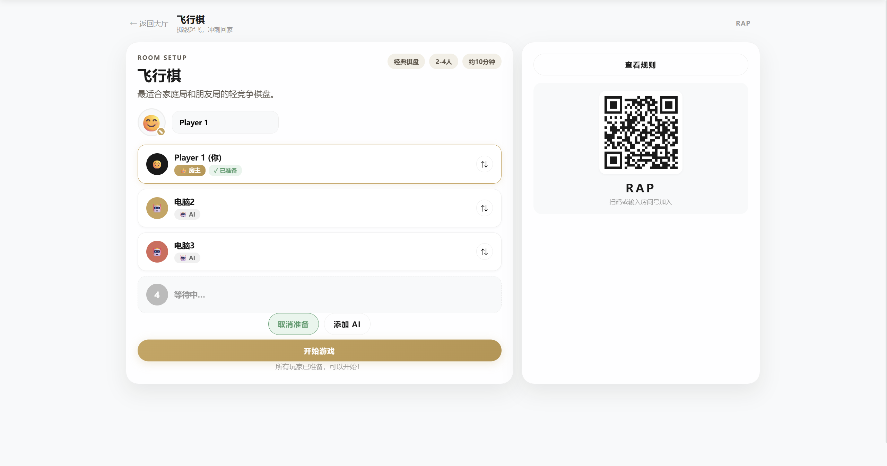
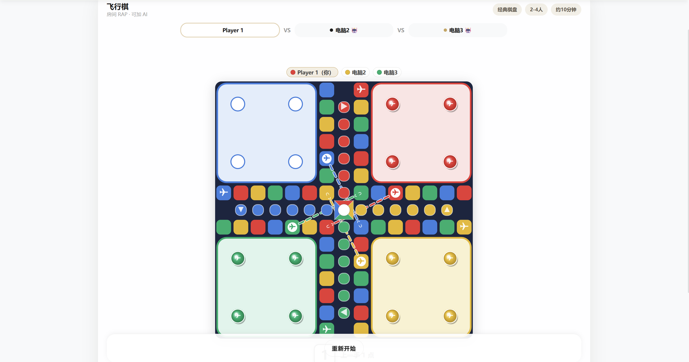
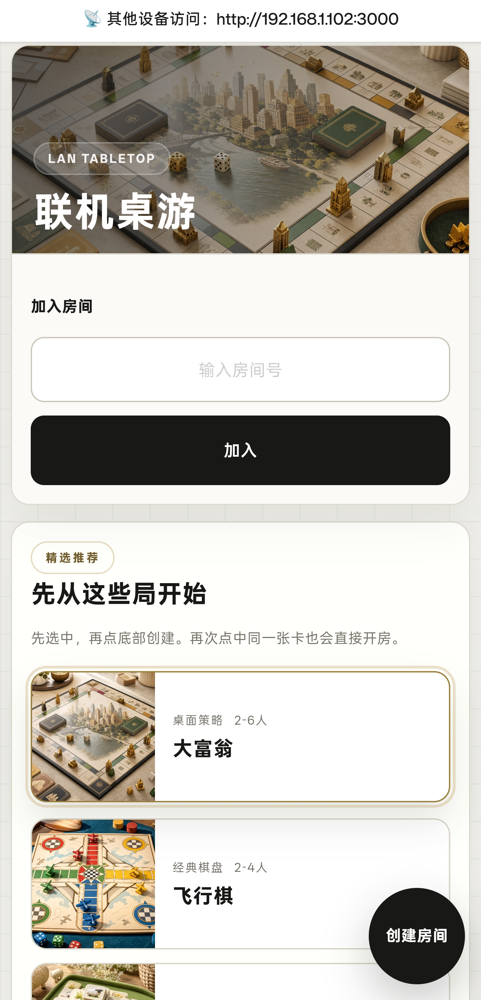

# GameNest

> 27 款自托管局域网桌游、卡牌、聚会、益智和实时对战游戏。一台设备开服，分享房间号或二维码，同一 WiFi 下用浏览器就能一起玩。

**[🚀 在线试玩](https://game-production-03da.up.railway.app/) — 无需安装，打开即玩。**

[](LICENSE)
[](https://github.com/absswds/GameNest/actions/workflows/ci.yml)
[](https://github.com/absswds/GameNest/actions/workflows/android-apk.yml)
[](https://nodejs.org/)
[](https://expressjs.com/)
[](#game-catalog)
[](#highlights)
[](#highlights)
[](#android-host)

简体中文 | [English](README.md)

GameNest 是一个轻量开源的局域网桌游房间，适合家庭娱乐、宿舍开黑、课堂活动、办公室摸鱼和朋友聚会。一台电脑或 Android 手机作为主机，其他设备在同一 WiFi 下直接通过浏览器加入。技术栈刻意保持简单：Express 4、`ws` 和原生 HTML/CSS/JavaScript。

## 亮点

- 内置 27 款游戏，覆盖经典棋盘、聚会卡牌、扑克、推理、脑力竞速和实时对战。
- 局域网优先：不需要账号，不依赖云服务，一台主机加一个 WiFi 就能开局。
- 支持房间号和二维码加入，手机、平板、电脑都能直接进房。
- 等待房间支持昵称、表情头像、准备状态、换座、加 AI 和游戏选项。
- 大多数回合制游戏支持 AI，对局人数不够或单人测试时也能跑起来。
- 每款游戏都有独立前端渲染器，支持隐藏信息视图、合法走法提示、Canvas 棋盘和轻量动画。
- 提供 Android 主机包装层，基于 nodejs-mobile，同一套项目也能变成随身局域网主机。

> 如果 GameNest 让你的游戏之夜更开心，欢迎点个 ⭐ 让更多人看到。

## 截图素材

GameNest 包含局域网大厅、二维码等待房间和浏览器内游戏棋盘：






手机端和加入流程：




## 快速开始

> 需要 Node.js 18 或更高版本。

```bash
npm install
npm start
```

主机打开大厅：

```text
http://localhost:3000
```

同一 WiFi 下的其他手机、平板或电脑访问：

```text
http://<主机IP>:3000
```

如果 Windows 上 `3000` 端口被旧的 Node 进程占用：

```powershell
taskkill /f /im node.exe
```

## 怎么玩

1. 在一台电脑或 Android 设备上启动 GameNest。
2. 打开大厅，选择想玩的游戏。
3. 创建房间，然后分享房间号、主机 IP 或二维码。
4. 在等待房间里换座、加 AI、改头像、准备，必要时调整游戏选项。
5. 房主开始游戏后，所有状态通过 WebSocket 在浏览器里同步。
6. 如果玩家临时退回大厅，可以通过大厅里的返回房间卡片继续回到原房间。

## 游戏列表

| 分类 | 游戏 |
| --- | --- |
| 经典棋盘 | 井字棋、五子棋、飞行棋、中国象棋、国际象棋、西洋跳棋、四子棋、黑白棋、围棋 9x9 |
| 聚会卡牌 | UNO、爆炸猫、数字炸弹、抽鬼牌、你画我猜、真心话大冒险 |
| 推理 | 达芬奇密码、骗子酒馆 |
| 扑克 | 斗地主、大老二、德州扑克 |
| 桌面策略 | 魔力桥、大富翁 |
| 脑力竞速 | 24 点、扫雷竞速、羊了个羊 |
| 实时对战 | 贪吃蛇大乱斗、合成大西瓜对战 |

## 常用命令

```bash
npm start             # 启动局域网服务器
npm test              # 运行回归测试
npm run check         # 检查项目 JavaScript 语法
npm run test:monopoly # 运行大富翁专项测试
npm run build:desktop # 构建 Windows 独立运行包
```

GitHub Actions 目前会自动跑 `npm run check` 和 `npm test`。

## 平台说明

### 浏览器主机

- 需要 Node.js `18+`
- HTTP 和 WebSocket 共用 `3000` 端口
- 适合电脑、教室、家庭局域网和临时聚会场景

### Android 主机

Android 工程会把同一套 Node.js 服务包装进 nodejs-mobile + WebView。

```powershell
cd android
.\copy-nodejs-project.ps1
```

然后用 Android Studio 打开 `android/` 并运行。完整说明见 [android/SETUP.md](android/SETUP.md)。

## 仓库结构

```text
.
|-- server.js                 # Express + WebSocket 服务端、房间管理、消息路由、AI 调度
|-- main.js                   # Android 的 nodejs-mobile 入口
|-- games/                    # 游戏规则与状态流转
|-- bots/                     # AI 走法生成
|-- lang/                     # 服务端文本
|-- public/                   # 大厅、游戏壳、渲染器、样式、资源
|-- scripts/                  # 检查和维护脚本
|-- tests/                    # node:test 回归测试
|-- android/                  # Android Studio 包装工程
`-- docs/                     # 架构与发布文档
```

补充资料：

- `lang/`（服务端文本）
- `public/js/lang/`（浏览器语言包）
- `public/js/game-catalog.js`（游戏元数据）
- `scripts/generate-cover-art.js`（封面生成）
- [docs/ARCHITECTURE.md](docs/ARCHITECTURE.md) 说明服务端、WebSocket 和渲染器流程。
- [CONTRIBUTING.md](CONTRIBUTING.md) 提供新增游戏清单。
  

## 参与贡献

欢迎提交 bug 修复、规则修正、AI 优化、渲染器打磨和新游戏。开始前建议先看 [CONTRIBUTING.md](CONTRIBUTING.md)。

## 协议

[Apache-2.0](LICENSE)
