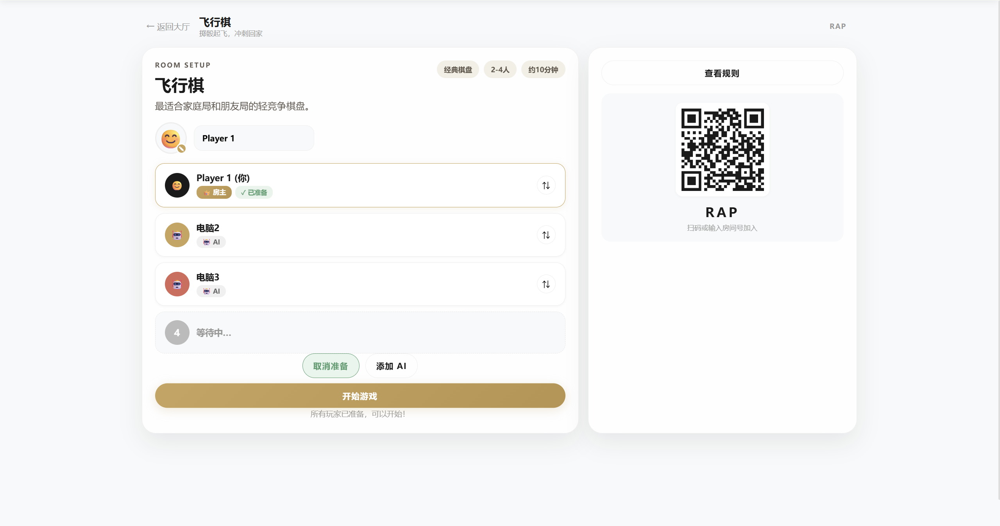
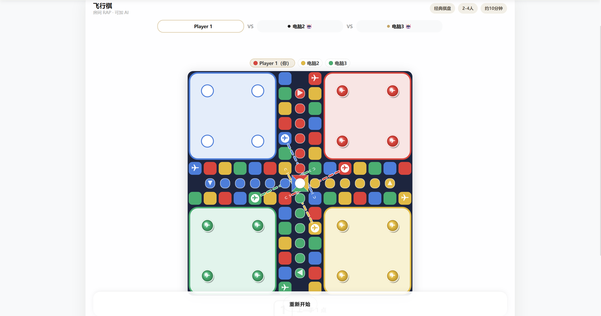
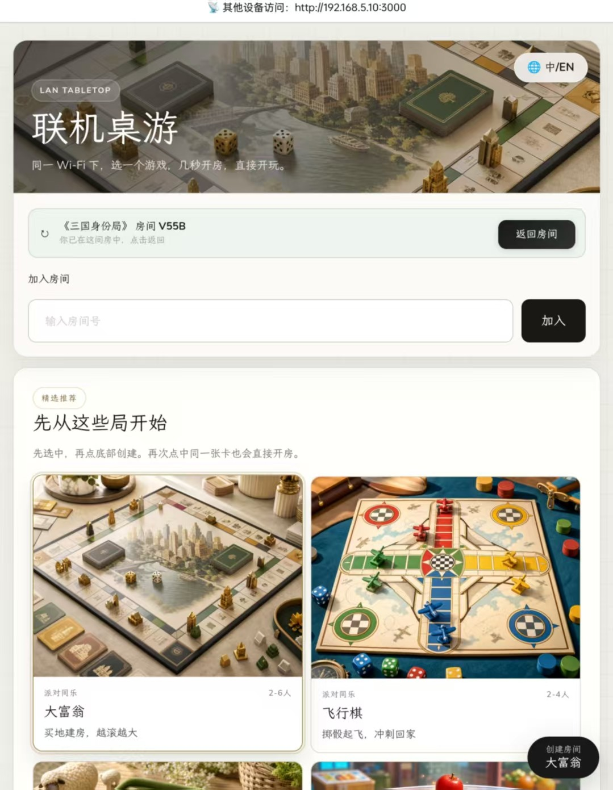

# GameNest

> 没网也能和朋友一起玩的 34 款局域网游戏：棋牌、麻将、聚会、益智、实时对战。一台手机或电脑开服（开热点就行），其他人扫码用浏览器加入，不用流量，不用装 App。

**[🚀 在线试玩](https://gamenest-4kww.onrender.com) — 无需安装，打开即玩。**

[](LICENSE)
[](https://github.com/absswds/GameNest/actions/workflows/ci.yml)
[](https://github.com/absswds/GameNest/actions/workflows/android-apk.yml)
[](https://nodejs.org/)
[](https://expressjs.com/)
[](#game-catalog)
[](#highlights)
[](#highlights)
[](#android-host)

简体中文 | [English](README.md)

GameNest 是一个轻量开源的局域网桌游房间，适合家庭娱乐、宿舍开黑、课堂活动、办公室摸鱼和朋友聚会。一台电脑或 Android 手机作为主机，其他设备在同一 WiFi 下直接通过浏览器加入。技术栈刻意保持简单：Express 4、`ws` 和原生 HTML/CSS/JavaScript。

## 为什么做 GameNest

起因很简单：和朋友坐飞机，几个小时没网、没事干，手机里的游戏要么得联网，要么只能自己玩。于是我们就做了 GameNest：一台手机开热点当主机，其他人用浏览器连上就能一起打牌下棋，不用流量，也不用每人装一个 App。

后来它也成了宿舍、聚会、家庭和课堂里随手就能开一局的工具。

## 亮点

- **断网也能玩**：飞机、高铁、露营、地下室都行。一台手机开热点或者连同一个 WiFi，全程不需要互联网。
- **只要一台装了它的设备**：Android 手机、Windows 电脑（独立 exe）或任何能跑 Node.js 的机器都能当主机。其他人扫二维码或输房间号，用浏览器就能进，不用安装。
- **34 款游戏**：棋盘、扑克、麻将、派对、推理、身份阵营、脑力竞速和实时对战都有，2 人到一大群人都能玩。
- **人不够就加 AI**：大多数回合制游戏都有电脑玩家，一个人也能练手。
- **掉线能回来**：断线或误退回大厅后，可以从大厅的返回卡片回到原座位继续。
- **隐藏信息是真隐藏**：手牌、身份等私密信息只发给本人，旁边的人抓包也看不到。
- **中英双语**，界面和规则教程都有。
- **没有账号、没有广告、不收集数据**：Apache-2.0 开源，技术栈简单（Express 4 + `ws` + 原生 JS，无需构建），想加游戏很容易。
- **AI 也能入座**：可选 MCP 服务（`mcp/`），Claude、Cursor、Codex 等 AI 可以像普通玩家一样加入对战，见 [mcp/README.zh-CN.md](mcp/README.zh-CN.md)。

> 如果 GameNest 让你的游戏之夜更开心，欢迎点个 ⭐ 让更多人看到。

## 截图素材

GameNest 包含局域网大厅、二维码等待房间和浏览器内游戏棋盘：






手机端和加入流程：




## 快速开始

> 需要 Node.js 18 或更高版本。

```bash
npm install
npm start
```

主机打开大厅：

```text
http://localhost:3000
```

同一 WiFi 下的其他手机、平板或电脑访问：

```text
http://<主机IP>:3000
```

如果 `3000` 端口被占用，服务器会自动尝试下一个可用端口，并在控制台打印实际地址。也可以用 `PORT=xxxx` 自己指定。

## 怎么玩

1. 在一台电脑或 Android 设备上启动 GameNest。
2. 打开大厅，选择想玩的游戏。
3. 创建房间，然后分享房间号、主机 IP 或二维码。
4. 在等待房间里换座、加 AI、改头像、准备，必要时调整游戏选项。
5. 房主开始游戏后，所有状态通过 WebSocket 在浏览器里同步。
6. 如果玩家临时退回大厅，可以通过大厅里的返回房间卡片继续回到原房间。

## 游戏列表

| 分类 | 游戏 |
| --- | --- |
| 棋盘对弈 | 井字棋、五子棋、中国象棋、国际象棋、西洋跳棋、四子棋、黑白棋、围棋 9路、战舰 |
| 牌桌竞技 | 德州扑克、斗地主、达芬奇密码、魔力桥、骗子酒馆、大老二、麻将（四川/广东）、红心大战、三国身份局 |
| 派对同乐 | 大富翁、飞行棋、你画我猜、UNO、数字炸弹、抽鬼牌、爆炸猫、真心话大冒险、狼人杀 |
| 脑力闯关 | 羊了个羊、24点、数独、2048、扫雷竞速 |
| 实时对战 | 合成大西瓜、贪吃蛇大乱斗 |

## 常用命令

```bash
npm start             # 启动局域网服务器
npm test              # 运行回归测试
npm run check         # 检查项目 JavaScript 语法
npm run test:monopoly # 运行大富翁专项测试
npm run build:desktop # 构建 Windows 独立运行包
```

GitHub Actions 目前会自动跑 `npm run check` 和 `npm test`。

## 平台说明

### 浏览器主机

- 需要 Node.js `18+`
- HTTP 和 WebSocket 共用 `3000` 端口
- 适合电脑、教室、家庭局域网和临时聚会场景

### Android 主机

Android 工程会把同一套 Node.js 服务包装进 nodejs-mobile + WebView。

```powershell
cd android
.\copy-nodejs-project.ps1
```

然后用 Android Studio 打开 `android/` 并运行。完整说明见 [android/SETUP.md](android/SETUP.md)。

## 仓库结构

```text
.
|-- server.js                 # Express + WebSocket 服务端、房间管理、消息路由、AI 调度
|-- desktop-entry.js          # 桌面启动器（pkg 入口，与 server.js 同级）
|-- startup-port.js           # 端口重试辅助（server.js 依赖）
|-- games/                    # 游戏规则与状态流转
|-- bots/                     # AI 走法生成
|-- lang/                     # 服务端文本
|-- public/                   # 大厅、游戏壳、渲染器、样式、资源
|-- scripts/                  # 检查和维护脚本
|-- tests/                    # node:test 回归测试
|-- android/                  # Android Studio 包装工程（含 nodejs-mobile main.js）
|-- mcp/                      # 可选 MCP 服务：让 AI 作为玩家加入房间
|-- docs/                     # 架构与发布文档
`-- archive/                  # 本地存档（不跟踪）
```

补充资料：

- `lang/`（服务端文本）
- `public/js/lang/`（浏览器语言包）
- `public/js/game-catalog.js`（游戏元数据）
- `scripts/generate-cover-art.js`（封面生成）
- [docs/ARCHITECTURE.md](docs/ARCHITECTURE.md) 说明服务端、WebSocket 和渲染器流程。
- [.github/CONTRIBUTING.md](.github/CONTRIBUTING.md) 提供新增游戏清单。
- [mcp/README.zh-CN.md](mcp/README.zh-CN.md) 说明如何让任意 MCP 客户端（Claude、Cursor、Codex、Gemini CLI 等）通过 stdio 或 HTTP 加入房间对战。
- [docs/releases/](docs/releases/) 是各版本发布说明。


## 参与贡献

欢迎提交 bug 修复、规则修正、AI 优化、渲染器打磨和新游戏。开始前建议先看 [CONTRIBUTING.md](.github/CONTRIBUTING.md)。

## 协议

[Apache-2.0](LICENSE)
